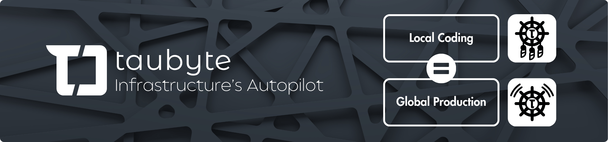

**Welcome to Taubyte! 🚀** Venture into a realm where infrastructure intelligently adapts and scales, empowering you to effortlessly bring ideas to a global audience.

<picture>
    <source media="(prefers-color-scheme: dark)" srcset="images/banner-v2.png">
    
</picture>
 

**Taubyte** redefines cloud computing, embodying the principle: **Infrastructure's Autopilot - Local Coding Equals Global Production.** We empower developers and platform engineers to innovate without the constraints of traditional cloud infrastructure management.

### 🌟 Embracing Best Practices

Taubyte is not just about automation; it's about embracing and implementing best practices across DevOps, GitOps, and Site Reliability Engineering (SRE) without the heavy lifting. Our platform is designed to integrate these practices seamlessly into your workflow, ensuring reliability, efficiency, and security are baked into your projects from the start. With Taubyte, you can even construct end-to-end (E2E) infrastructure tests for your applications, providing confidence in your deployments and operational excellence.

### 🛠️ Elevating Platform Engineering

For platform engineers, Taubyte is a game-changer. It takes platform engineering to the next level by providing the tools and autonomy to customize and perfect your cloud environment. With Taubyte, you're not building from scratch; you're standing on the shoulders of giants, equipped to tailor and enhance your infrastructure with minimal effort and maximum efficiency.

### 💡 A Developer-Centric Experience

We understand that at the heart of every great innovation is a developer's experience. Taubyte prioritizes this experience, ensuring that what you build locally works seamlessly when scaled globally. Our ecosystem supports a variety of development environments and languages, making it as easy as possible to develop, test, and deploy your applications.

### 🌍 Emphasis on Edge Computing & Distributed Systems

Taubyte is pioneering the frontier of edge computing and distributed systems, harnessing the power of the libp2p Peer-to-Peer protocol to deliver a resilient and scalable cloud infrastructure. Our approach revolutionizes content delivery and data management by leveraging advanced techniques like content addressing, deduplication, and peer-based block swapping, coupled with the robustness of Conflict-Free Replicated Data Types (CRDTs). This combination ensures efficient network connectivity, optimized resource use, and seamless data synchronization across distributed systems. It's the backbone of our platform, enabling developers to build applications that are not only globally scalable but also inherently robust and responsive, providing a superior edge-native data experience.

### 🔭 Expanding Our Technology Horizon

- **WebAssembly (Wasm) at Our Core:** We believe Wasm is the future of cloud computing, offering unparalleled speed, security, and portability. Taubyte is built to leverage Wasm's strengths, ensuring your applications run faster and more securely, anywhere.
- **Native Support for JavaScript and Python:** Understanding the diversity of development environments, Taubyte is expanding its runtime to include native support for JavaScript and Python. This means developers can work in their preferred language while benefiting from Taubyte's global scaling and infrastructure automation.
- **Future-Proofing with Containers and VMs:** While we champion the efficiency and security of Wasm, we also recognize the importance of flexibility in cloud computing. Taubyte has plans to integrate containers and virtual machines into our platform, providing a comprehensive suite of options for deploying and managing your applications, regardless of complexity or scale.

### Dive Into Our Ecosystem

Our GitHub is home to a suite of tools designed to make cloud computing intuitive and accessible:

- **[tau](https://github.com/taubyte/tau)**: The heart of Taubyte, our autonomous cloud computing platform that puts your infrastructure on autopilot.
- **[dreamland](https://github.com/taubyte/dreamland)**: A sandbox environment for local development, ensuring what you build works seamlessly when scaled.
- **[vm](https://github.com/taubyte/vm)**: The engine behind our serverless functions and smart operations, enabling efficient, scalable cloud applications.
- **[vm-orbit](https://github.com/taubyte/vm-orbit)**: A system to extend our WebAssembly runtime with amazing features like Large Language Models (LLM). It's what powers [ollama-cloud](https://github.com/ollama-cloud), a Cloud Stack for Ollama, allowing developers to build AI applications the Taubyte way: build locally, scale globally, effortlessly.

We're passionate about open-source and believe in the power of community-driven development. Your contributions, feedback, and engagement are what drive Taubyte forward.

**Ready to transform how you build and scale in the cloud?** Get started with our repositories and join the Taubyte community to share, learn, and collaborate. 

### 📜 License

All Taubyte public repositories, unless specified otherwise, are licensed under either [3-Clause BSD](https://opensource.org/licenses/BSD-3-Clause) or [MIT](https://opensource.org/licenses/MIT). Check out individual repositories for detailed license information.

### Connect With Us

- **Website**: [taubyte.com](https://taubyte.com/)
- **Twitter**: [@dtaubyte](https://twitter.com/dtaubyte)
- **Discord**: [discord.gg/taubyte](https://discord.gg/NFhh5X3V)
